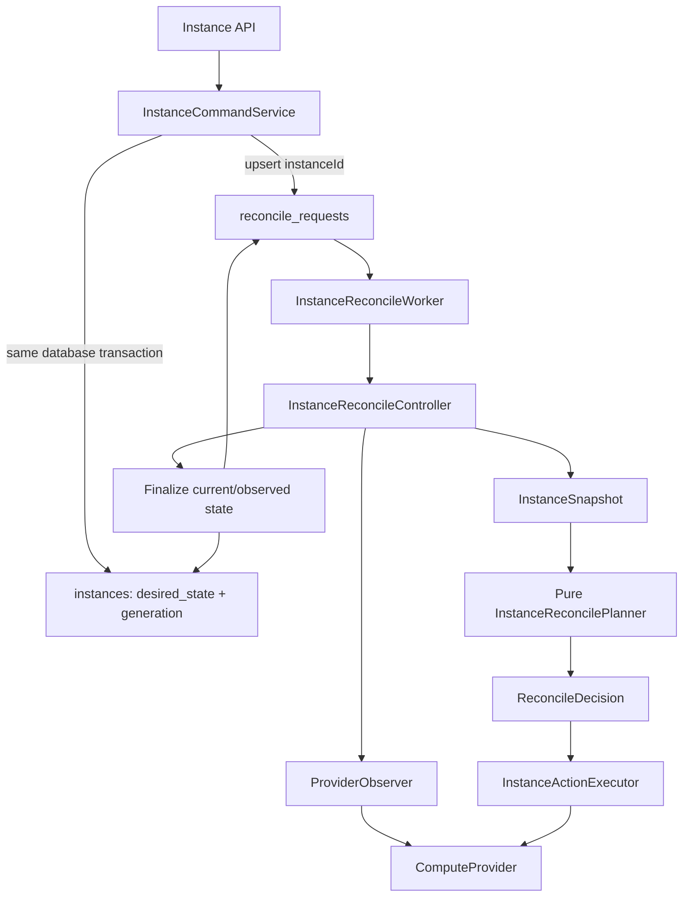
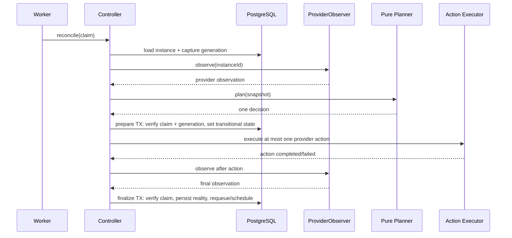

# Polaris Declarative Reconciliation V3 — System Design

## 1. Requirement Understanding

Polaris cần chuyển lifecycle của instance từ command queue:

```text
START_INSTANCE / STOP_INSTANCE / DELETE_INSTANCE
```

sang một control loop declarative:

```text
desired state → observe provider → plan → act → persist observation
```

Queue không mang business command. Queue chỉ biểu diễn rằng một `instanceId` cần được reconcile. Worker luôn đọc desired state mới nhất nên một command cũ không thể tiếp tục đại diện cho intent đã lỗi thời.

Mục tiêu của V3:

- API chỉ thay đổi intent.
- PostgreSQL là durable source cho desired state và reconcile queue.
- Queue coalesce nhiều thay đổi của cùng một instance thành một work item.
- Planner là pure function, không phụ thuộc Spring, JPA hay Docker.
- Controller thực hiện tối đa một corrective provider action trong mỗi cycle.
- Provider action idempotent và có thể retry sau crash.
- Hệ thống phát hiện cả intent change lẫn provider drift.
- Một instance không bị hai reconcile worker đồng thời finalize.
- `CREATE_INSTANCE` tiếp tục là provisioning flow riêng trong V3.1.

### Non-goals của V3

V3 không thêm Kafka, Redis queue, CQRS, event sourcing, leader election, sharding hay shared informer cache. PostgreSQL queue đủ để học và triển khai đúng claim, lease, retry, coalescing, fencing và crash recovery.

---

## 2. Review kiến trúc hiện tại

### Những phần nên giữ

Code hiện tại đã có nhiều nền móng tốt:

- `Instance` đã tách `desiredState` và `currentState`.
- `ComputeProvider` đã là provider port, còn `DockerComputeProvider` là adapter.
- Task worker đã có `FOR UPDATE SKIP LOCKED`.
- Claim token đang được dùng như fencing token khi finalize task.
- Provider I/O không nằm trong HTTP transaction.
- Start/stop/delete đã có logic idempotency ở một số đường chạy.
- Quota release có cờ `quotaReleased`, phù hợp cho compensation idempotent.
- Integration test hiện tại đã kiểm tra concurrent claim và crash recovery của create flow.

Những cơ chế này nên được tái sử dụng về mặt ý tưởng, không cần viết lại từ đầu.

### Những phần chưa phải declarative controller

`RepairService` hiện tại vẫn chọn:

```text
TaskType.START_INSTANCE
TaskType.STOP_INSTANCE
TaskType.DELETE_INSTANCE
```

từ `desiredState/currentState`. Vì vậy nó là repair layer cho command queue, chưa phải resource reconciliation queue.

`ConvergenceReconciler.findNonConvergedInstanceIds()` chỉ nhìn:

```sql
desired_state <> current_state
```

Query này có hai vấn đề:

1. Bỏ sót provider drift:

   ```text
   desired = RUNNING
   current = RUNNING
   Docker = STOPPED
   ```

2. So sánh hai enum có semantics khác nhau. `current_state` có các trạng thái chuyển tiếp như `STARTING`, `STOPPING`, `DELETING`, trong khi `desired_state` chỉ có stable intent.

Các reconciler `StartReconciler`, `StopReconciler`, `DeleteReconciler` và các task handler đang cùng thực hiện provider side effect. Khi V3 hoàn tất, chỉ một controller pipeline được quyền làm lifecycle side effect; nếu không, hai execution path có thể cùng điều khiển một container.

### Rủi ro concurrency hiện tại

- Application check `existsBy...StatusIn()` không thay thế database invariant.
- Database chưa ngăn hai active lifecycle task khác type trên cùng instance.
- `maxAttempts = 5` phù hợp với command task nhưng không phù hợp với control loop lâu dài. Controller không nên vĩnh viễn từ bỏ desired state chỉ vì năm lỗi tạm thời.
- `locked_at < cutoff` là timeout recovery, chưa phải lease rõ ràng. Thiết kế V3 dùng `lease_expires_at` để diễn đạt đúng ownership window.
- `container_id` là tên Docker-specific trong một domain đang có provider abstraction. V3.1 có thể giữ để migration nhỏ; về sau nên đổi thành `provider_resource_id`.

---

## 3. Design Decision

### Kiến trúc mục tiêu



### Quyết định chính

1. `reconcile_requests` là work queue theo resource, không phải task history.
2. Mỗi instance có đúng tối đa một queue row nhờ `PRIMARY KEY (instance_id)`.
3. Queue row giữ generation mới nhất cần xử lý để coalesce intent changes.
4. API update desired state và wake queue trong cùng PostgreSQL transaction.
5. Planner quyết định từ snapshot; retry/backoff và claim ownership thuộc controller/queue layer.
6. Mỗi cycle thực hiện tối đa một provider mutation: `START`, `STOP` hoặc `DELETE`.
7. Sau action, controller observe lại provider để persist reality; observe không được tính là corrective action.
8. Converged instance vẫn được scheduled resync định kỳ để phát hiện external drift.
9. Outbox không kích hoạt critical reconcile path. Outbox chỉ fan-out audit, metrics, websocket hoặc notification sau này.

### Vì sao không dùng `RECONCILE_INSTANCE` trong `TaskType`

`TaskType.RECONCILE_INSTANCE` vẫn khiến queue contract mang khái niệm task/operation. V3 cần queue contract chỉ là:

```java
public record ClaimedReconcileRequest(
        UUID instanceId,
        long requestedGeneration,
        UUID claimToken
) {}
```

Planner mới quyết định action tại thời điểm xử lý dựa trên intent và provider reality mới nhất.

---

## 4. Data Model Impact

### 4.1 `instances`

Thêm các cột bằng Flyway migration mới; không sửa migration cũ đã chạy:

```sql
ALTER TABLE instances
    ADD COLUMN generation BIGINT NOT NULL DEFAULT 1,
    ADD COLUMN observed_generation BIGINT NOT NULL DEFAULT 0,
    ADD COLUMN last_observed_state TEXT NOT NULL DEFAULT 'UNKNOWN',
    ADD COLUMN last_observed_at TIMESTAMPTZ;

ALTER TABLE instances
    ADD CONSTRAINT chk_instance_generation_positive
        CHECK (generation > 0),
    ADD CONSTRAINT chk_instance_observed_generation_valid
        CHECK (observed_generation >= 0
               AND observed_generation <= generation),
    ADD CONSTRAINT chk_instance_last_observed_state
        CHECK (last_observed_state IN (
            'MISSING', 'CREATED', 'RUNNING', 'STOPPED', 'UNKNOWN'
        ));
```

Ý nghĩa:

| Field | Ý nghĩa |
|---|---|
| `desired_state` | Intent mới nhất của user/control plane |
| `current_state` | Lifecycle state Polaris đã persist |
| `generation` | Phiên bản của desired/spec, tăng khi intent thật sự thay đổi |
| `observed_generation` | Generation gần nhất controller đã đánh giá và persist kết quả |
| `last_observed_state` | Cache của provider observation gần nhất, không phải provider truth vĩnh viễn |
| `last_observed_at` | Thời điểm observation được lấy |
| `version` | JPA optimistic lock; không thay thế `generation` |

`generation == observed_generation` không có nghĩa instance chắc chắn converged. Delete là multi-step (`STOP`, rồi `DELETE`) và provider có thể drift sau lần observe. Convergence luôn được xác định từ desired state và observation mới.

`requestStart()`, `requestStop()`, `requestDelete()` chỉ tăng generation nếu desired state thật sự đổi:

```java
public boolean requestStart() {
    if (desiredState == DesiredState.RUNNING) {
        return false;
    }
    desiredState = DesiredState.RUNNING;
    generation++;
    return true;
}
```

Delete là terminal intent. `requestStart()` và `requestStop()` phải reject nếu desired state đã là `DELETED`.

### 4.2 `reconcile_requests`

Schema đề xuất:

```sql
CREATE TABLE reconcile_requests
(
    instance_id          UUID PRIMARY KEY
        REFERENCES instances (id),

    status               TEXT NOT NULL DEFAULT 'READY',
    requested_generation BIGINT NOT NULL,
    available_at         TIMESTAMPTZ NOT NULL DEFAULT now(),

    failure_count        INT NOT NULL DEFAULT 0,
    claim_token          UUID,
    claimed_by           TEXT,
    lease_expires_at     TIMESTAMPTZ,
    last_error           TEXT,

    created_at           TIMESTAMPTZ NOT NULL DEFAULT now(),
    updated_at           TIMESTAMPTZ NOT NULL DEFAULT now(),

    CONSTRAINT chk_reconcile_status
        CHECK (status IN ('READY', 'RUNNING', 'BLOCKED')),
    CONSTRAINT chk_reconcile_failure_count
        CHECK (failure_count >= 0),
    CONSTRAINT chk_reconcile_claim_shape
        CHECK (
            (status = 'RUNNING'
                AND claim_token IS NOT NULL
                AND claimed_by IS NOT NULL
                AND lease_expires_at IS NOT NULL)
            OR
            (status <> 'RUNNING'
                AND claim_token IS NULL
                AND claimed_by IS NULL
                AND lease_expires_at IS NULL)
        )
);

CREATE INDEX idx_reconcile_requests_poll
    ON reconcile_requests (available_at, instance_id)
    WHERE status = 'READY';

CREATE INDEX idx_reconcile_requests_expired_lease
    ON reconcile_requests (lease_expires_at)
    WHERE status = 'RUNNING';
```

Không cần partial unique index vì `instance_id` đã là primary key. Queue này không giữ success history; audit/outbox đảm nhiệm lịch sử.

### Queue state semantics

| Status | Ý nghĩa |
|---|---|
| `READY` | Có thể claim khi `available_at <= now()`; `available_at` tương lai cũng dùng cho periodic resync/backoff |
| `RUNNING` | Một worker đang giữ lease |
| `BLOCKED` | Lỗi/policy không retry nóng; desired generation mới sẽ wake lại |

Không cần `IDLE`. Khi converged, row trở về `READY` với `available_at = now() + resyncInterval`. Nhờ vậy queue tự thực hiện periodic observation mà không cần một sweeper thứ hai quét `desired <> current`.

Wake phải coalesce mà không đánh cắp ownership của worker đang chạy:

```sql
INSERT INTO reconcile_requests (
    instance_id, status, requested_generation, available_at
)
VALUES (:instanceId, 'READY', :generation, now())
ON CONFLICT (instance_id) DO UPDATE
SET requested_generation = GREATEST(
        reconcile_requests.requested_generation,
        EXCLUDED.requested_generation
    ),
    status = CASE
        WHEN reconcile_requests.status = 'RUNNING' THEN 'RUNNING'
        ELSE 'READY'
    END,
    available_at = CASE
        WHEN reconcile_requests.status = 'RUNNING'
            THEN reconcile_requests.available_at
        ELSE now()
    END,
    failure_count = CASE
        WHEN EXCLUDED.requested_generation
             > reconcile_requests.requested_generation THEN 0
        ELSE reconcile_requests.failure_count
    END,
    last_error = CASE
        WHEN EXCLUDED.requested_generation
             > reconcile_requests.requested_generation THEN NULL
        ELSE reconcile_requests.last_error
    END,
    updated_at = now();
```

Khi row đang `RUNNING`, wake chỉ cập nhật `requested_generation`; nó không thay `claim_token`, `claimed_by` hay lease. Finalize thấy generation mới hơn sẽ tự trả row về `READY` ngay. Khi row đang `BLOCKED`, desired generation mới chuyển nó về `READY` và xóa failure cũ.

### 4.3 Invariants

Database và application phải cùng enforce:

```text
1 instance = 1 reconcile queue row
1 RUNNING row = 1 claim token + 1 unexpired lease
finalize chỉ hợp lệ với claim token hiện tại
generation chỉ tăng khi desired/spec thay đổi
DELETED là terminal desired state
quota chỉ release sau khi provider resource MISSING
```

Trong migration V3.1, `CREATE_INSTANCE` task vẫn tồn tại. Reconcile controller phải trả `WAIT` khi instance đang `PENDING/PROVISIONING` hoặc còn active create task, để create handler và reconcile executor không cùng mutate provider.

---

## 5. Domain Model và Pure Planner

### 5.1 Observation model

```java
public enum ProviderObservedState {
    MISSING,
    CREATED,
    RUNNING,
    STOPPED,
    UNKNOWN
}
```

`MISSING` phải khác `UNKNOWN`:

- `MISSING`: provider xác nhận không có resource.
- `UNKNOWN`: provider timeout, lỗi transport hoặc trả trạng thái không hiểu được.

Không được biến provider exception thành `MISSING`, vì việc đó có thể khiến delete/quota release sai.

### 5.2 Planner input

```java
public record InstanceSnapshot(
        DesiredState desiredState,
        CurrentState currentState,
        ProviderObservedState observedState,
        boolean provisioningActive
) {}
```

`instanceId`, `generation`, `claimToken` không nằm trong snapshot vì chúng không ảnh hưởng business decision. Chúng thuộc `ReconcileExecutionContext` của controller.

### 5.3 Planner output

```java
public enum ReconcileDecision {
    NOOP,
    START,
    STOP,
    DELETE,
    WAIT,
    INVALID
}
```

- `WAIT`: chưa đủ certainty hoặc provisioning đang sở hữu resource; controller requeue với delay.
- `INVALID`: policy không cho phép hội tụ; controller ghi condition/error và chuyển queue `BLOCKED`.
- Retry/backoff không phải provider action. Queue service chọn thời gian retry dựa trên failure class.

### 5.4 State matrix V3.1

Guard được áp dụng trước matrix:

| Guard | Decision |
|---|---|
| `current = DELETED && desired != DELETED` | `INVALID` — không resurrect |
| `provisioningActive = true` | `WAIT` — create flow đang sở hữu provider lifecycle |
| `observed = UNKNOWN` | `WAIT` — không hành động khi observation không chắc chắn |
| `current = FAILED && desired != DELETED` | `INVALID` trong V3.1 |

Stable matrix:

| Desired | Observed | Decision | Final state/policy |
|---|---|---|---|
| `RUNNING` | `RUNNING` | `NOOP` | persist `RUNNING` |
| `RUNNING` | `STOPPED` | `START` | cycle sau/no-op xác nhận `RUNNING` |
| `RUNNING` | `CREATED` | `START` | cycle sau/no-op xác nhận `RUNNING` |
| `RUNNING` | `MISSING` | `INVALID` V3.1 | provider resource mất; không tự recreate ngầm |
| `STOPPED` | `RUNNING` | `STOP` | persist result rồi requeue nếu cần |
| `STOPPED` | `STOPPED` | `NOOP` | persist `STOPPED` |
| `STOPPED` | `CREATED` | `NOOP` | normalize current thành `STOPPED` |
| `STOPPED` | `MISSING` | `NOOP` | clear provider id, persist `STOPPED` |
| `DELETED` | `RUNNING` | `STOP` | delete là convergence nhiều cycle |
| `DELETED` | `STOPPED` | `DELETE` | cycle sau xác nhận `MISSING` |
| `DELETED` | `CREATED` | `DELETE` | resource chưa chạy vẫn có thể delete |
| `DELETED` | `MISSING` | `NOOP` | persist `DELETED`, release quota |

V3.2 có thể thêm `CREATE`/`RECREATE` cho:

```text
desired RUNNING + observed MISSING
```

Nhưng đây là policy quan trọng, không chỉ là kỹ thuật. Recreate có thể làm mất local ephemeral data và thay provider identity, vì vậy V3.1 chọn fail visibly thay vì resurrect ngầm.

### 5.5 Planner contract

Planner phải là Java object thuần:

```java
public final class InstanceReconcilePlanner {
    public ReconcileDecision plan(InstanceSnapshot snapshot) {
        // exhaustive switch only
    }
}
```

Planner không:

- inject repository/provider;
- gọi Docker;
- ghi log;
- publish event;
- đọc clock;
- quyết định retry delay;
- thay đổi entity.

---

## 6. API / Service Flow

### 6.1 Command API semantics

Các endpoint hiện tại có thể giữ nguyên:

```text
POST   /instances/{id}/start
POST   /instances/{id}/stop
DELETE /instances/{id}
```

Response nên là `202 Accepted`, trả:

```text
instanceId
desiredState
currentState
generation
```

Client poll GET instance để xem convergence. API không trả lifecycle task id vì lifecycle không còn là task command.

### 6.2 Transaction của command

```mermaid
sequenceDiagram
    participant API
    participant Command as InstanceCommandService
    participant DB as PostgreSQL

    API->>Command: requestStop(tenantId, instanceId)
    Command->>DB: lock instance by tenant + id
    Command->>Command: requestStop(); generation++ if changed
    Command->>DB: upsert reconcile request with generation
    Command->>DB: insert audit/outbox event (optional)
    DB-->>Command: commit
    Command-->>API: 202 desired=STOPPED
```

Pseudocode:

```java
@Transactional
public InstanceResponse stopInstance(UUID tenantId, UUID instanceId) {
    Instance instance = instanceRepository
            .findByIdAndTenantIdForUpdate(instanceId, tenantId)
            .orElseThrow(...);

    boolean changed = instance.requestStop();
    reconcileQueueService.wake(instance.getId(), instance.getGeneration());

    if (changed) {
        outboxRepository.append(InstanceDesiredChanged.from(instance));
    }
    return InstanceResponse.from(instance);
}
```

Queue wake vẫn chạy cả khi desired không đổi. Điều này cho phép client/operator chủ động kick lại một resource đang `BLOCKED` hoặc đang chờ resync mà không tạo generation giả.

Start/stop không cần lock `Tenant`; chỉ create/quota mutation mới cần tenant lock. Tenant isolation vẫn được enforce bằng query `(instanceId, tenantId)`.

### 6.3 Delete policy

API delete không yêu cầu `currentState == STOPPED`. Nó chỉ đặt:

```text
desired = DELETED
```

Planner tự hội tụ:

```text
RUNNING → STOP → DELETE → MISSING
```

Delete intent là terminal; request start/stop sau đó trả conflict.

---

## 7. Reconcile Controller Flow

### 7.1 Claim

Claim theo PostgreSQL:

```sql
SELECT *
FROM reconcile_requests
WHERE status = 'READY'
  AND available_at <= now()
ORDER BY available_at, instance_id
FOR UPDATE SKIP LOCKED
LIMIT :limit;
```

Trong cùng transaction:

```text
status = RUNNING
claim_token = random UUID
claimed_by = workerId
lease_expires_at = now + leaseDuration
```

Worker chỉ nhận immutable `ClaimedReconcileRequest`. Không truyền JPA entity sang thread khác.

### 7.2 Một reconcile cycle



### 7.3 Phase A — Observe và plan, không giữ DB lock

Controller:

1. Load instance và capture `generation`.
2. Xác định create provisioning có active không.
3. Observe provider ngoài transaction dài.
4. Build `InstanceSnapshot`.
5. Gọi planner.

Provider timeout phải được cấu hình ngắn hơn lease duration.

### 7.4 Phase B — Prepare transaction

Trước provider mutation:

```text
lock reconcile row
verify claim_token và lease
lock instance
verify instance.generation == claimed/requested generation
verify decision vẫn hợp lệ với current control-plane guard
set current_state = STARTING / STOPPING / DELETING
commit
```

Nếu generation đã đổi trước action, không gọi provider. Chuyển request về `READY` ngay để cycle mới plan từ intent mới.

Thứ tự lock phải cố định ở mọi flow:

```text
reconcile_request → instance → tenant (chỉ khi release quota)
```

Điều này giảm deadlock giữa finalize, API và compensation.

### 7.5 Phase C — Execute một action ngoài transaction

`InstanceActionExecutor` nhận execution context và decision:

```java
public interface InstanceActionExecutor {
    void execute(ReconcileExecutionContext context,
                 ReconcileDecision decision);
}
```

Trong V3.1 chỉ có một implementation dùng `ComputeProvider`. Không cần tạo một generic executor framework cho từng provider vì `ComputeProvider` đã là port.

Idempotency contract:

```text
START  + already RUNNING → success/no-op
STOP   + STOPPED/CREATED → success/no-op
STOP   + MISSING         → success/no-op
DELETE + MISSING         → success/no-op
DELETE + resource exists → delete theo provider contract
```

### 7.6 Phase D — Finalize transaction

Sau action, observe lại provider rồi:

```text
lock reconcile row
verify claim token
lock instance
persist last_observed_state + last_observed_at
update current_state theo provider reality
set observed_generation = generation đã được cycle đánh giá
```

Sau đó quyết định queue:

| Điều kiện | Queue outcome |
|---|---|
| Generation/requested generation đã đổi | `READY`, `available_at = now()` |
| Provider chưa đạt expected result | `READY` với retry backoff |
| Decision `WAIT` | `READY` với short delay |
| Converged | `READY` với periodic resync delay |
| Decision `INVALID` | `BLOCKED`, ghi `last_error` |
| Terminal `DELETED + MISSING` | xóa queue row hoặc giữ `BLOCKED`; V3 chọn xóa row |

Nếu desired đổi trong khi action chạy, controller vẫn persist provider reality do action vừa tạo ra, nhưng không được coi generation mới là đã xử lý. Nó requeue ngay.

Ví dụ:

```text
Cycle claim generation 5: desired RUNNING
START thành công
Trong lúc START, API đổi desired STOPPED, generation 6
Finalize ghi current/observed RUNNING cho reality vừa thấy
Không set observed_generation = 6
Requeue ngay
Cycle generation 6 quyết định STOP
```

Controller không chạy `STOP` trong cycle generation 5.

---

## 8. Retry, Lease và Crash Recovery

### Failure classification

| Failure | Policy |
|---|---|
| Provider timeout/connection failure | retry exponential backoff |
| Provider `UNKNOWN` | wait/retry, không mutate |
| Optimistic/stale generation | immediate requeue, không tăng failure count |
| Stale claim token | worker cũ dừng, không finalize |
| Invalid domain state | `BLOCKED`, cần intent/operator change |
| Resource missing khi policy không cho recreate | `BLOCKED` và expose condition |

Backoff đề xuất:

```text
min(2 ^ failure_count seconds, 5 minutes) + small jitter
```

`failure_count` là số lỗi liên tiếp và reset về 0 khi cycle có progress/converged. Không dùng `maxAttempts = 5` để vĩnh viễn bỏ reconcile. Sau nhiều lỗi, hệ thống tiếp tục resync với capped backoff và expose alert/condition.

### Lease recovery

Reaper claim các row:

```sql
SELECT *
FROM reconcile_requests
WHERE status = 'RUNNING'
  AND lease_expires_at < now()
FOR UPDATE SKIP LOCKED
LIMIT :limit;
```

Sau đó:

```text
status = READY
available_at = now()
clear claim fields
failure_count++
```

### Crash windows

#### Crash trước provider action

Lease hết hạn, worker khác observe và plan lại. Không có external side effect cần bù.

#### Provider action thành công, crash trước finalize

Worker mới observe provider reality. Idempotent executor biến retry thành no-op hoặc planner trả `NOOP`; không tạo duplicate action.

#### Lease hết hạn trong lúc worker cũ còn gọi provider

Worker cũ không thể finalize vì claim token đã thay đổi. Hai provider calls có thể overlap, nên idempotency của provider operation là bắt buộc. V3.1 đặt provider timeout nhỏ hơn lease. Heartbeat/lease extension chỉ thêm nếu action thực tế có thể chạy lâu.

#### DB commit thành công nhưng worker không nhận response

Retry/finalize với claim cũ sẽ bị fencing token chặn hoặc planner sẽ observe state đã persist.

---

## 9. Component và Package Design

Package đề xuất, giữ package-by-feature hiện tại:

```text
com.cloud.polaris.reconcile
├── domain
│   ├── ProviderObservedState.java
│   ├── InstanceSnapshot.java
│   ├── ReconcileDecision.java
│   ├── ReconcileExecutionContext.java
│   └── ClaimedReconcileRequest.java
├── planner
│   └── InstanceReconcilePlanner.java
├── queue
│   ├── ReconcileRequest.java
│   ├── ReconcileRequestStatus.java
│   ├── ReconcileRequestRepository.java
│   └── ReconcileQueueService.java
├── service
│   ├── InstanceReconcileController.java
│   ├── ProviderObserver.java
│   ├── InstanceActionExecutor.java
│   └── ReconcileFinalizationService.java
└── worker
    ├── InstanceReconcileWorker.java
    └── ReconcileLeaseRecovery.java
```

Trách nhiệm:

| Component | Trách nhiệm duy nhất |
|---|---|
| `InstanceCommandService` | Validate tenant/policy, update desired + generation, wake queue |
| `ReconcileQueueService` | Upsert, claim, lease, requeue, backoff, block, complete terminal |
| `InstanceReconcileWorker` | Poll theo capacity và dispatch claim |
| `ProviderObserver` | Normalize provider response thành observed state |
| `InstanceReconcilePlanner` | Pure state decision |
| `InstanceReconcileController` | Orchestrate observe-plan-prepare-act-finalize |
| `InstanceActionExecutor` | Thực hiện một idempotent provider mutation |
| `ReconcileFinalizationService` | Fenced DB update và queue scheduling |

Không để planner gọi executor; controller là orchestration boundary.

---

## 10. Migration Plan từ code hiện tại

### Phase 0 — Bảo vệ baseline

- Giữ nguyên create task và các integration test create recovery.
- Không để `ConvergenceReconciler` mới và reconciler cũ cùng chạy provider side effect.
- Ghi rõ feature flag/config cho V3 worker trong migration.

### Phase 1 — Pure planner

Tạo:

```text
ProviderObservedState
InstanceSnapshot
ReconcileDecision
InstanceReconcilePlanner
```

Viết exhaustive unit test cho matrix. Phase này chưa đổi production pipeline.

### Phase 2 — Generation và durable coalescing queue

- Flyway migration thêm generation/observation fields.
- Tạo `reconcile_requests`.
- Implement `wake`, `claim`, `requeue`, lease recovery.
- Thêm PostgreSQL concurrency integration test.

### Phase 3 — Command API chỉ đổi desired state

- Start/stop/delete bỏ tạo lifecycle task.
- API cho phép đổi desired trong transitional states.
- Delete không còn bắt buộc current `STOPPED`.
- Update desired và queue wake trong cùng transaction.

Tạm thời feature flag V3 worker có thể tắt cho tới khi controller hoàn tất.

### Phase 4 — Observe → Plan → Act controller

- Tạo observer, controller, executor và finalization service.
- Mỗi cycle một action.
- Chuyển logic tốt từ old handlers vào idempotent executor.
- `CREATE_INSTANCE` handler tiếp tục xử lý `PENDING/PROVISIONING`.

### Phase 5 — Cutover một execution path

- Bật V3 worker.
- Tắt `StartReconciler`, `StopReconciler`, `DeleteReconciler`, `ConvergenceReconciler/RepairService` và lifecycle task handlers khỏi scheduling/registry.
- Giữ `CREATE_INSTANCE` task worker.
- Sau thời gian migration, bỏ `START_INSTANCE`, `STOP_INSTANCE`, `DELETE_INSTANCE`, `RECONCILE_INSTANCE` khỏi `TaskType` và constraint database.

Không để cả old lifecycle worker và V3 controller active cùng lúc.

### Phase 6 — Reliability và operations

- Capped exponential backoff + jitter.
- Lease recovery và optional heartbeat.
- Periodic resync.
- Metrics, structured log và admin retry endpoint.
- Cân nhắc V3.2 `RECREATE` sau khi chốt policy dữ liệu/identity.

---

## 11. Edge Cases và Failure Recovery Policy

### Rapid desired changes

```text
RUNNING → STOPPED → RUNNING
```

Mỗi thay đổi tăng generation. Queue vẫn chỉ có một row và giữ generation mới nhất. Worker đang chạy bị fencing bằng generation check/finalization requeue.

### Duplicate API request

Nếu desired không đổi, không tăng generation. Queue vẫn được wake để hỗ trợ manual retry. API trả cùng desired/current state.

### Provider resource duplicate

`findByInstanceId()` hiện throw khi có nhiều Docker container. Đây là lựa chọn an toàn. Controller chuyển request `BLOCKED`, emit alert; không tự delete một resource ngẫu nhiên.

### Provider resource missing

- Desired `STOPPED`: converge `STOPPED`, clear provider resource id.
- Desired `DELETED`: converge `DELETED`, release quota.
- Desired `RUNNING`: `BLOCKED` trong V3.1; V3.2 mới thêm explicit recreate policy.

### Delete và quota

Quota chỉ release sau fresh observation `MISSING`. `UNKNOWN` tuyệt đối không được coi là deleted. `quotaReleased` giữ operation idempotent.

### Create đang chạy, user stop/delete

API cập nhật desired và wake queue. V3 controller thấy provisioning active thì `WAIT`. Create handler hiện tại phải tiếp tục kiểm tra desired state và dừng/dọn provider. Sau khi create task kết thúc, reconcile cycle mới hoàn tất stop/delete.

### Transitional state bị kẹt

Planner quyết định chủ yếu từ fresh provider observation, không từ tên transitional state. Vì vậy `STARTING + observed RUNNING` có thể finalize `RUNNING`; `STOPPING + observed STOPPED` có thể finalize `STOPPED`.

---

## 12. Testing Strategy

### Pure planner unit tests

- Mọi dòng trong state matrix.
- Guard `DELETED` terminal.
- `UNKNOWN → WAIT`.
- Provisioning active → `WAIT`.
- Delete chạy nhiều cycle: `RUNNING → STOP`, `STOPPED → DELETE`, `MISSING → NOOP`.

### Queue integration tests với PostgreSQL/Testcontainers

- Hai worker không claim cùng row.
- Nhiều API wake cùng instance chỉ tạo một row.
- Wake khi `RUNNING` cập nhật requested generation nhưng không phá claim token.
- Lease expiry đưa row về `READY`.
- Claim token cũ không finalize được.
- `available_at` và `SKIP LOCKED` hoạt động đúng.

### Controller tests

- Mỗi cycle gọi tối đa một provider mutation.
- Desired đổi trong khi START: cycle hiện tại persist RUNNING và requeue; cycle sau STOP.
- Crash sau provider success, retry observe thành công và không duplicate side effect.
- Provider `UNKNOWN` không update thành `MISSING`.
- Delete chỉ release quota sau observation `MISSING`.
- Periodic resync phát hiện `desired/current RUNNING` nhưng Docker STOPPED.

### API integration tests

- Start/stop/delete update desired và queue atomically.
- Delete từ RUNNING được accept và hội tụ nhiều cycle.
- Start sau desired DELETED trả conflict.
- Tenant A không wake/reconcile instance của tenant B qua API.

---

## 13. Observability

Metrics tối thiểu:

```text
polaris_reconcile_queue_ready
polaris_reconcile_queue_running
polaris_reconcile_cycles_total{decision,outcome}
polaris_reconcile_duration_seconds
polaris_reconcile_failure_count{category}
polaris_reconcile_lease_recoveries_total
polaris_reconcile_generation_lag
polaris_provider_observe_duration_seconds
polaris_provider_action_duration_seconds{action}
polaris_instances_blocked_total{reason}
```

Structured log fields:

```text
instanceId
tenantId
generation
observedGeneration
claimToken
workerId
desiredState
currentState
observedState
decision
```

Không log trong planner. Controller log decision và outcome để giữ pure planner deterministic.

---

## 14. Alternatives và quyết định loại bỏ

### Spring domain event trực tiếp để enqueue

Không chọn vì có crash window giữa business commit và event listener. Queue upsert cùng transaction đơn giản và mạnh hơn. Outbox vẫn dùng cho non-critical subscribers.

### Giữ `RECONCILE_INSTANCE` trong bảng tasks

Có thể dùng làm migration ngắn, nhưng không phải target. Task table giữ operation history; reconcile queue là coalescing resource work và có lifecycle khác.

### Một cycle chạy nhiều action

Không chọn vì cycle có thể kéo dài, retry khó xác định và desired có thể đổi liên tục. Một action/cycle cho execution trace rõ và bounded.

### Chỉ enqueue khi API thay desired

Không chọn vì không phát hiện external drift. Delayed periodic resync được giữ trong queue bằng `available_at`.

### Dùng `@Version` thay generation

Không chọn vì entity version tăng bởi mọi DB update, kể cả current state/observation. Generation chỉ phiên bản hóa desired/spec intent.

---

## 15. Definition of Done cho V3.1

V3.1 hoàn tất khi:

- Start/stop/delete không tạo lifecycle task.
- Queue chỉ chứa instance identity + operational metadata.
- Planner pass toàn bộ pure matrix tests.
- PostgreSQL enforce một queue row mỗi instance.
- Hai worker không thực hiện finalize hợp lệ cho cùng claim.
- Desired đổi giữa provider action được requeue theo generation.
- Crash sau provider success tự phục hồi bằng observation + idempotency.
- Periodic resync phát hiện provider drift dù desired bằng current.
- Mỗi cycle có tối đa một provider mutation.
- Old lifecycle reconcilers/handlers không còn active.
- Create task recovery và quota compensation vẫn pass.

---

## 16. Interview Explanation

> Polaris models user intent separately from provider reality. Lifecycle APIs only update desired state and atomically wake a PostgreSQL-backed, coalescing reconcile queue keyed by instance ID. Workers use leases and fencing tokens, observe Docker, run a pure planner, and execute at most one idempotent corrective action per cycle. Generation-aware finalization prevents stale work from overwriting newer intent, while periodic resync and provider observation recover from drift and worker crashes.
